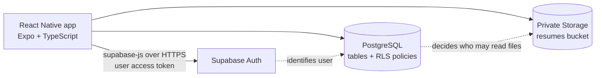
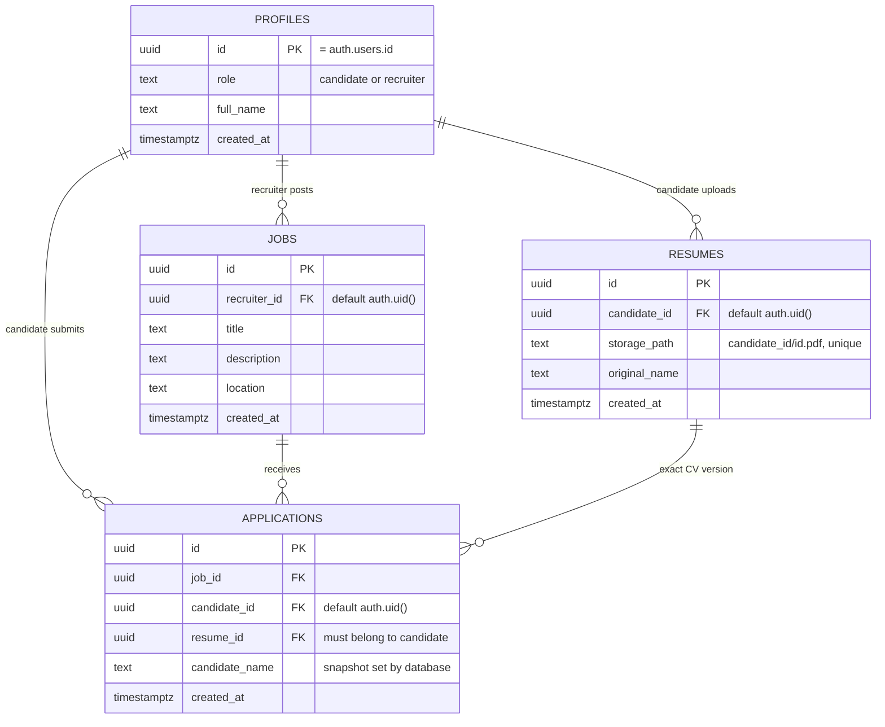

# TalentHunter Mobile

A React Native mobile app for the TalentHunter technical assessment. **Candidates** upload a PDF CV, browse jobs and apply. **Recruiters** post jobs and review applicants and their submitted CVs — and only their own.

## Deliverables

| Item                                      | Link                                                                                               |
| ----------------------------------------- | -------------------------------------------------------------------------------------------------- |
| Android APK v1.0.2 (standalone, ~66.5 MB) | [Google Drive](https://drive.google.com/file/d/1uK2NEgned1_CZipw3v9SGKEfij--UYYC/view?usp=sharing) |
| Source code                               | This repository                                                                                    |
| Setup, commands, data model, tests, scope | This README                                                                                        |

The APK connects to the hosted Supabase backend and does not need a development server. Demo logins are shared privately.

## Features

**Candidate**

- Sign up / sign in, email-code confirmation and password recovery
- Upload a PDF CV (max 5 MB); every upload is kept as a new version
- Browse jobs, open a job and apply with the current CV
- See which jobs they have already applied to (duplicates are blocked)

**Recruiter**

- Post jobs
- See only their own jobs and the applicants for them
- Open the exact CV version a candidate submitted, via a 60-second private link

## Tech stack

| Layer           | Technology                                                                   |
| --------------- | ---------------------------------------------------------------------------- |
| Mobile app      | React Native 0.86, Expo SDK 57, TypeScript 6                                 |
| Navigation      | Expo Router (file-based routes, role-based redirects)                        |
| Authentication  | Supabase Auth (email + password, email OTP, recovery)                        |
| Database        | Supabase PostgreSQL with Row-Level Security (RLS)                            |
| File storage    | Supabase Storage, private `resumes` bucket, signed URLs                      |
| Session storage | Expo SecureStore                                                             |
| Testing         | Node test runner, live Supabase checks, Postman/Newman, Maestro device flows |
| Tooling         | VS Code, Prettier, EAS-free local native builds (Gradle / Xcode)             |

There is no custom server. The app talks directly to Supabase, and **all access rules are enforced in the database**, so they hold even if someone bypasses the app and calls the API directly.

## Architecture



Apply flow: candidate taps **Apply** → app inserts `{ job_id, resume_id }` → Postgres checks the user is a candidate, owns that CV and has not already applied → database fills in candidate ID, name and timestamp → recruiter who owns the job can now read the application and request a signed link to that CV.

## Database shape



**Key rules** (all in [`supabase/migrations/202609140001_initial.sql`](supabase/migrations/202609140001_initial.sql)):

| Rule                                                                          | How it is enforced                                     |
| ----------------------------------------------------------------------------- | ------------------------------------------------------ |
| Profile created at signup                                                     | Trigger on `auth.users` copies role and name           |
| Owners can't be forged                                                        | Column-level grants; owner IDs default to `auth.uid()` |
| Any signed-in user can read jobs; only recruiters post                        | RLS policies on `jobs`                                 |
| One application per candidate per job                                         | `unique (job_id, candidate_id)`                        |
| Can't apply with someone else's CV                                            | Composite foreign key `(resume_id, candidate_id)`      |
| Application visible only to its candidate and the job's recruiter             | RLS on `applications`                                  |
| CV file/metadata visible only to its owner or a recruiter it was submitted to | RLS on `resumes` and `storage.objects`                 |
| Submitted records are immutable                                               | No UPDATE/DELETE grants                                |

## Project structure

| Path                                                    | Purpose                                            |
| ------------------------------------------------------- | -------------------------------------------------- |
| `src/app/sign-in.tsx`                                   | Sign in, sign up, confirmation and recovery        |
| `src/app/index.tsx`, `_layout.tsx`                      | Redirects to candidate or recruiter area by role   |
| `src/app/candidate/`                                    | Job feed, job detail + Apply, CV profile           |
| `src/app/recruiter/`                                    | Own jobs, post job, applicants                     |
| `src/providers/AuthProvider.tsx`                        | Session and profile state                          |
| `src/lib/supabase.ts`                                   | Shared Supabase client                             |
| `src/lib/api.ts`, `resumeUpload.ts`, `applicantPage.ts` | Queries, CV upload, signed links, applicant paging |
| `src/components/`                                       | Shared UI, branding, email verification            |
| `supabase/migrations/`                                  | Schema, constraints, RLS and Storage policies      |
| `supabase/templates/`                                   | Confirmation and recovery email templates          |
| `tests/`                                                | Unit, integration, Postman and Maestro tests       |
| `scripts/`                                              | Backend selection, local Supabase, builds, QA      |

## Getting started

**Requirements:** Node 22.13+ and npm. For native builds: Android SDK 36 + Java 17, or Xcode 26.4+ with CocoaPods.

```sh
git clone https://github.com/Assembler-Fourier/talenthunter-mobile.git
cd talenthunter-mobile
npm ci
cp .env.example .env   # add Supabase URL and publishable key
npm start
```

`.env` holds **only public client values**:

```dotenv
EXPO_PUBLIC_SUPABASE_URL=https://your-project.supabase.co
EXPO_PUBLIC_SUPABASE_PUBLISHABLE_KEY=your-publishable-key
```

Never put a service-role/secret key in the app. The publishable key only identifies the project; RLS decides what each user can access.

In the Metro terminal press `i` (iOS simulator), `a` (Android emulator) or `w` (web). Stop with Ctrl+C.

## Commands

### Run

| Command                           | What it does                                   |
| --------------------------------- | ---------------------------------------------- |
| `npm start`                       | Metro on port 8081 against hosted Supabase     |
| `npm run web`                     | Web preview against hosted Supabase            |
| `npm run dev:phone`               | Metro for a physical phone on the same network |
| `npm run ios` / `npm run android` | Build and run a native dev app                 |

### Backend setup

Apply `supabase/migrations/202609140001_initial.sql` once to a **new, empty** Supabase project (see [supabase/README.md](supabase/README.md)). For real signup emails, configure SMTP and the templates in `supabase/templates/`.

Optional local Supabase (Docker/OrbStack):

| Command               | What it does                                                  |
| --------------------- | ------------------------------------------------------------- |
| `npm run local:start` | Start local Supabase (API 54321, Studio 54323, Mailpit 54324) |
| `npm run local:seed`  | Create synthetic local test data                              |
| `npm run dev:local`   | Metro on port 8082 against local Supabase                     |
| `npm run local:stop`  | Stop local services (data kept)                               |

Local and hosted accounts are separate.

### Test

| Command                                                                               | Needs                     | What it checks                                                                                                                    |
| ------------------------------------------------------------------------------------- | ------------------------- | --------------------------------------------------------------------------------------------------------------------------------- |
| `npm run typecheck`                                                                   | —                         | TypeScript compiles                                                                                                               |
| `npm run format:check`                                                                | —                         | Prettier formatting                                                                                                               |
| `npm run test:unit`                                                                   | —                         | **39 tests**: config, secure session storage, email flows, CV upload, applicant paging                                            |
| `npm run check:hosted`                                                                | Private demo account file | **25 checks** on the live dataset: logins, jobs, CV bytes, recruiter isolation                                                    |
| `npm run test:postman`                                                                | Private demo account file | **17 API requests / 29 assertions**: anonymous and invalid-token denial, candidate reads, recruiter isolation, signed-link denial |
| `npm run test:security`                                                               | Admin setup file          | Creates temporary users/data, verifies permissions with ordinary users, cleans up                                                 |
| `npm run test:local`, `test:audit:local`, `test:boundaries:local`, `test:email:local` | Local Supabase            | Integration, boundary and email scenarios                                                                                         |

Maestro screen flows live in `tests/mobile/` (see its [README](tests/mobile/README.md)). The Postman collection is in `tests/postman/` and can be imported into Postman with the example environment.

Run test suites **one at a time**; fixture-creating suites must not overlap with the demo-data checks.

### Build

| Command                                              | Output                                                                                                              |
| ---------------------------------------------------- | ------------------------------------------------------------------------------------------------------------------- |
| `npm run build:android`                              | Standalone APK at `android/app/build/outputs/apk/release/app-release.apk` (debug signing key, not a Play Store key) |
| `npm run build:ios:simulator`                        | Debug simulator app (keep Metro running)                                                                            |
| `npm run build:iphone` then `npm run install:iphone` | Standalone Release app on a configured iPhone (needs Apple signing and `.local/ios-device.json`)                    |

## Verified

- Final APK exercised on an Android API 36 emulator: sign-in, recruiter signup/confirmation, job posting, candidate CV upload and apply, CV replacement, session restart, cold start without Metro.
- Release build installed and used on a physical iPhone against hosted Supabase.
- Email confirmation and password recovery verified with a real inbox.
- Unit, hosted and Postman suites passing as listed above.

These are observed journeys and automated checks, not a claim of complete device or accessibility coverage.

## Scope decisions

- **PDF only**, up to 5 MB — keeps upload and viewing simple and predictable.
- **One signup form with a role choice** instead of separate candidate/employer onboarding.
- **CV versions are immutable** — a new upload never changes past applications.
- **No custom backend** — Supabase RLS is the single place access rules live.
- **No AI matching, company teams or payments** — outside the assessment brief.

## Known limitations and next steps

1. Application stages (shortlisted, interview, offer, rejected) and push notifications
2. Company accounts: profiles, team invitations, employer verification
3. Candidate job search/filters, saved jobs, alerts and feed pagination
4. Server-side file validation and malware scanning; cleanup of orphaned uploads
5. AI CV scoring via a server-side function, with human review
6. CI pipeline, crash reporting, Play Store / App Store release signing
7. GDPR data export, retention and deletion

Branding belongs to TalentHunter; this app is an assessment prototype using fictional demo data.
